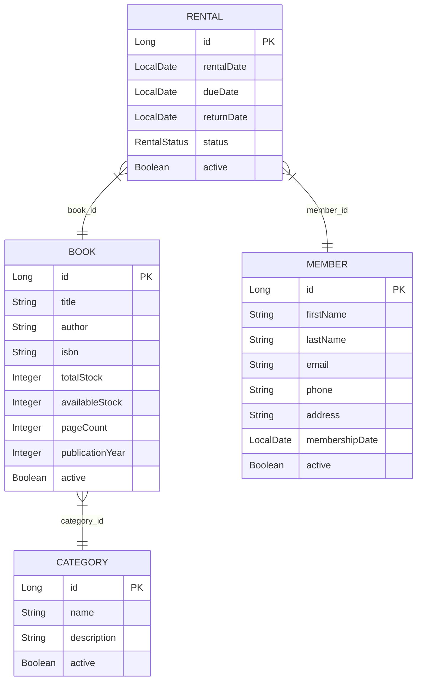

# Library Management REST API

Bu proje, Java 17 ve Spring Boot ile geliştirilmiş, katmanlı mimariye sahip bir Kütüphane Kitap Kiralama REST API sistemidir.

## Proje Hakkında
Kütüphane kitaplarını, kategorileri, üyeleri ve kitap kiralama işlemlerini yönetmeyi sağlayan kurumsal standartlarda bir REST API'dir. Soft-delete mekanizması, stok yönetimi, iş kuralı doğrulamaları ve hata yönetimi özellikleri içerir.

## Kullanılan Teknolojiler
- **Java 17**
- **Spring Boot**
- **Spring Web**
- **Spring Data JPA**
- **PostgreSQL**
- **Lombok**
- **Jakarta Validation API**
- **Springdoc OpenAPI (Swagger)**
- **Docker & Docker Compose**

## Mimari Yapı
Projede **Katmanlı Mimari (Layered Architecture)** tercih edilmiştir:
- **Entities**: Veritabanı tablolarına karşılık gelen nesneler (`com.fdrcyln.entities`)
- **DTOs**: İstek (Request) ve yanıt (Response) modelleri (`com.fdrcyln.dto`)
- **Controllers**: Dış dünyaya açılan API katmanı (`com.fdrcyln.controller`)
- **Services**: İş kurallarının uygulandığı katman (`com.fdrcyln.service`)
- **Repositories**: Veritabanı erişim katmanı (`com.fdrcyln.repository`)
- **Mappers**: DTO ile Entity dönüşümlerini gerçekleştiren katman (`com.fdrcyln.mapper`)
- **Exception Handling**: Global hata yönetimi ve özel istisnalar (`com.fdrcyln.exception`)
- **Common**: Ortak kullanılan generic sınıflar (`com.fdrcyln.common`)

---

## Entity İlişkileri



---

## API Endpoints

### 1. Kitap (Book) Endpoints
| HTTP Method | Path | Açıklama |
| :--- | :--- | :--- |
| `POST` | `/api/books` | Yeni kitap ekler (Validation doğrulaması içerir). |
| `GET` | `/api/books` | Sadece aktif (`active=true`) kitapları listeler. |
| `GET` | `/api/books/{id}` | ID'ye göre kitap detayı getirir. |
| `PUT` | `/api/books/{id}` | Kitap bilgilerini günceller. |
| `DELETE` | `/api/books/{id}` | Kitabı soft-delete (`active=false`) yapar. |
| `GET` | `/api/books/search?title={title}` | Kitap adına göre case-insensitive arama yapar. |
| `GET` | `/api/books/category/{categoryId}` | Belirli bir kategoriye ait aktif kitapları listeler. |
| `GET` | `/api/books/available` | Stokta olan (`availableStock > 0`) ve aktif kitapları listeler. |

### 2. Kategori (Category) Endpoints
| HTTP Method | Path | Açıklama |
| :--- | :--- | :--- |
| `POST` | `/api/categories` | Yeni kategori ekler. |
| `GET` | `/api/categories` | Sadece aktif kategorileri listeler. |
| `GET` | `/api/categories/{id}` | ID'ye göre kategori detayı getirir. |
| `PUT` | `/api/categories/{id}` | Kategori günceller. |
| `DELETE` | `/api/categories/{id}` | Kategoriyi soft-delete yapar. |

### 3. Üye (Member) Endpoints
| HTTP Method | Path | Açıklama |
| :--- | :--- | :--- |
| `POST` | `/api/members` | Yeni üye kaydeder. |
| `GET` | `/api/members` | Sadece aktif üyeleri listeler. |
| `GET` | `/api/members/{id}` | ID'ye göre üye detayı getirir. |
| `PUT` | `/api/members/{id}` | Üye bilgilerini günceller. |
| `DELETE` | `/api/members/{id}` | Üyeyi soft-delete yapar. |

### 4. Kiralama (Rental) Endpoints
| HTTP Method | Path | Açıklama |
| :--- | :--- | :--- |
| `POST` | `/api/rentals` | Kitap kiralama işlemi başlatır. |
| `PUT` | `/api/rentals/{id}/return` | Kitap iade işlemini gerçekleştirir. |
| `GET` | `/api/rentals/active` | Aktif kiralamaları listeler. |
| `GET` | `/api/rentals/member/{memberId}` | Belirli üyenin kiralama geçmişini listeler. |
| `GET` | `/api/rentals/late` | Gecikmiş kiralamaları listeler (Aktif ve teslim tarihi geçmiş olanları `LATE` yapar). |

---

## Kiralama İş Kuralları
1. Aynı üye, aktif bir kiralaması (`RentalStatus.ACTIVE`) bulunurken aynı kitabı tekrar kiralayamaz.
2. Bir üye aynı anda en fazla 3 aktif kitaba sahip olabilir.
3. Kiralama süresi en az 1 gün olmalıdır.
4. Kitap kiralandığında `availableStock` 1 azalır, teslim edildiğinde 1 artar.
5. Soft-delete edilmiş (pasif) kitap kiralanamaz.
6. Soft-delete edilmiş (pasif) üye kitap kiralayamaz.
7. Daha önce teslim edilmiş (`RentalStatus.RETURNED`) bir kiralama kaydı için tekrar teslim işlemi yapılamaz.

---

## Kurulum Adımları

### Veritabanı Yapılandırması (`application.properties`)
`application.properties` dosyası hassas veriler içerdiğinden git reposuna eklenmemiştir. Bunun yerine şu adımları izleyin:

1. `LibApi/src/main/resources/application-example.properties` dosyasının bir kopyasını oluşturun ve adını `application.properties` olarak değiştirin.
2. Oluşturduğunuz `application.properties` dosyasındaki veritabanı ayarlarını (`username`, `password`, vb.) kendi ortamınıza göre güncelleyin.

```properties
spring.datasource.url=jdbc:postgresql://localhost:5432/postgres?currentSchema=library
spring.datasource.username=kendi_kullanici_adiniz
spring.datasource.password=kendi_sifreniz
```

### Docker ile Çalıştırma (Tavsiye Edilen)
Docker ve Docker Compose kullanarak tüm sistemi tek bir komutla ayağa kaldırabilirsiniz:

1. Proje kök dizininde terminali açın.
2. Aşağıdaki komutu çalıştırın:
   ```bash
   docker compose up --build
   ```
   Bu komut:
   - PostgreSQL veritabanını ayağa kaldırır.
   - `library` şemasını veritabanında otomatik oluşturur.
   - Spring Boot uygulamasını derleyip ayağa kaldırır.

---

## API Testi ve Dokümantasyon

### Swagger UI
Uygulama çalıştıktan sonra API endpointlerini test etmek ve OpenAPI dokümantasyonuna ulaşmak için tarayıcınızdan şu adrese gidin:
- http://localhost:8080/swagger-ui/index.html

### Başarılı Yanıt Formatı (`ApiResponse`)
Tüm başarılı istekler generic `ApiResponse` yapısında döner:
```json
{
  "success": true,
  "message": "İşlem başarılı",
  "data": { ... }
}
```

### Hata Yanıt Formatı (`ErrorResponse`)
Genel ve iş kuralı hatalarında aşağıdaki format kullanılır:
```json
{
  "success": false,
  "message": "Hata mesajı",
  "status": 400,
  "timestamp": "2026-07-08T04:30:00"
}
```

### Validation Hataları Yanıt Formatı
DTO validation kuralları ihlal edildiğinde dönen response formatı:
```json
{
  "success": false,
  "message": "Validation failed",
  "status": 400,
  "timestamp": "2026-07-08T04:30:00",
  "errors": {
    "title": "Kitap adı boş olamaz",
    "email": "Geçerli bir e-posta adresi giriniz"
  }
}
```
